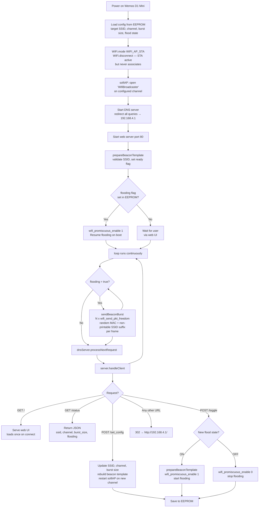

# Wemos D1 Mini Lite - WiFi Beacon Flooder

> **For use in controlled lab environments only.**

Floods a target WiFi channel with 802.11 beacon frames for a specified SSID. Each beacon is injected with a fresh random locally-administered MAC address **and** a unique non-printable byte suffix appended to the SSID, so every frame has a distinct SSID byte-sequence and bypasses scanner deduplication. Configured via a built-in captive portal web UI — no router needed.

**Stack:** Arduino C/C++, ESP8266 raw packet injection (`wifi_send_pkt_freedom`), DNSServer, ESP8266WebServer, EEPROM

## How It Works



## Beacon Frame Structure

Each injected frame is a standard 802.11 management beacon assembled fresh per frame:

| Section | Size | Notes |
|---------|------|-------|
| MAC header | 24 bytes | Frame type = management/beacon; DA = broadcast; SA + BSSID = random per frame |
| Beacon fixed fields | 12 bytes | Interval = 100 TUs; Capability = ESS + short preamble |
| Tag 0: SSID | 2 + n bytes | Target SSID + 1–4 random non-printable bytes (0x01–0x1F) |
| Tag 1: Supported Rates | 10 bytes | 1, 2, 5.5, 11, 18, 24, 36, 54 Mbps |
| Tag 3: DS Parameter Set | 3 bytes | Declares the configured channel |

The non-printable suffix makes each frame's SSID byte-sequence unique, bypassing deduplication in scanners that group by exact bytes. The variable SSID length means the full frame is assembled fresh on every injection — the pre-built template is just a ready flag, not a static buffer.

MAC addresses use locally-administered unicast format (bit 1 set, bit 0 clear in the first octet) and are re-randomised for every frame.

## Hardware Requirements

- Wemos D1 Mini Lite (ESP8266 / ESP8285)
- USB cable for programming and power

## Software Requirements

- Arduino IDE 1.8.x or newer
- ESP8266 Board Package 3.x — provides `user_interface.h`, `libmain.a` (contains `wifi_send_pkt_freedom`), and `libnet80211.a` (contains `ieee80211_freedom_output`)

### Installing ESP8266 Board Package

1. Open Arduino IDE → **File → Preferences**
2. Add to "Additional Board Manager URLs":
   ```
   http://arduino.esp8266.com/stable/package_esp8266com_index.json
   ```
3. **Tools → Board → Boards Manager** → search "esp8266" → install

## Installation

1. Open `wifi_broadcaster.ino` in Arduino IDE
2. **Tools → Board → ESP8266 Boards → LOLIN(WEMOS) D1 mini Lite**
3. **Tools → Port** → select the Wemos port
4. Upload (→)

No credentials need editing — everything is configured at runtime.

## Usage

### First Time Setup

1. Power on the device
2. Connect to the open network **`WifiBroadcaster`**
3. Captive portal redirects to the config UI (or navigate to `http://192.168.4.1`)

### Configuration

| Field | Options | Description |
|-------|---------|-------------|
| **Target SSID** | any string, max 31 chars | The base SSID name to flood |
| **Channel** | 1–13 | WiFi channel to inject on |
| **SSID Count Per Burst** | 10 / 25 / 50 / 100 / 200 / 500 | Unique frames injected per loop iteration |

1. Enter the target SSID, select the channel and burst size
2. Click **Save Config** — fires and forgets, inputs stay as-is
3. Click **Start Flooding** — badge flips to `FLOODING` immediately

### UI Behaviour

- The page fetches saved config once on load to populate the fields
- **Save** posts the config silently — no page update, no flicker
- **Toggle** reads the server response and updates the badge and button text in-place
- There is no background polling

### Verifying the Flood

The phone's built-in WiFi settings deduplicate by SSID name — they will always show one row. To see individual injected frames use a tool that displays BSSIDs:

| Tool | Platform |
|------|----------|
| WiFi Analyzer (open source) | Android |
| WiFi Explorer | macOS |
| `airport -s` in Terminal | macOS |
| Wireshark (monitor mode, filter `wlan.fc.type_subtype == 8`) | Any |

### Reconfiguring While Flooding

The config AP (`WifiBroadcaster`) stays up on the same channel throughout. Connect to it and visit `192.168.4.1` to change settings or stop flooding at any time. Config and flood state persist across power cycles — the device resumes on reboot.

## Configuration Options

### Default Setup AP Name

```cpp
const char* CONFIG_AP_SSID = "WifiBroadcaster";
```

### Defaults applied on first boot or EEPROM wipe (magic byte `0xAC`)

```cpp
config.target_ssid = "TargetSSID";
config.channel     = 6;
config.burst_size  = 50;
config.flooding    = false;
```

### Burst Size

Set via the **SSID Count Per Burst** dropdown in the UI. Higher values flood more aggressively but reduce web UI responsiveness. 50–100 is a good balance for most lab scenarios.

## Technical Notes

### WiFi Mode

The device runs in `WIFI_AP_STA` mode. `WIFI_AP` alone suppresses raw frame injection on this SDK version — the STA layer must be initialised for `wifi_send_pkt_freedom` to activate the PHY. `WiFi.disconnect()` prevents the STA from ever scanning or associating.

### Promiscuous Mode

`wifi_promiscuous_enable(1)` is called when flooding starts and `wifi_promiscuous_enable(0)` when it stops. This bypasses the SDK's normal receive filter, which is required for `wifi_send_pkt_freedom` to inject frames reliably on NONOSDK 22x.

### Call Chain

```
wifi_send_pkt_freedom()        — libmain.a
  └─ ieee80211_freedom_output() — libnet80211.a
```

### Channel Sync

`wifi_send_pkt_freedom` transmits on whatever channel the radio is currently tuned to. When the user changes the channel via `set_config`, the softAP is restarted on the new channel before injection resumes, keeping the config AP and the flood channel in sync.

### Single Radio

The ESP8266 has one radio. The config AP and the beacon flood always operate on the same channel. There is no way to flood channel X while accepting config connections on channel Y.

## Legal Notice

Beacon flooding disrupts the WiFi environment on the target channel for all nearby devices. **Only operate this device inside a properly RF-isolated lab.** Uncontrolled use violates FCC Part 15, Ofcom regulations, and equivalent rules in other jurisdictions.
