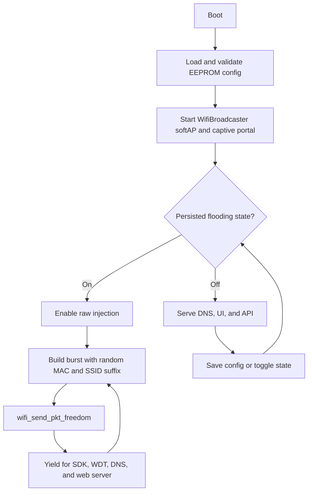

# Wemos D1 Mini Lite WiFi Beacon Flooder

> **Controlled lab use only.** This firmware transmits disruptive 802.11 beacon
> traffic. Power and operate the DUT only inside a properly RF-isolated test
> environment. Reflashing does not clear EEPROM, so a previously enabled DUT
> can resume flooding immediately after reboot.

This project runs on a Wemos D1 Mini Lite (ESP8266/ESP8285). It exposes an open
configuration AP named `WifiBroadcaster` and a small web UI at
`http://192.168.4.1`. Each transmitted beacon uses a new locally administered
MAC address and a changing non-printable suffix after the configured base SSID.

## Start here

- [Build and flash both sketches](BUILDING.md)
- [Run the two-board hardware test](TESTING.md)
- [Main firmware](wemos-wifi-barodcaster/wemos-wifi-barodcaster.ino)
- [Passive beacon counter](test-tools/beacon-counter/beacon-counter.ino)
- [Two-port serial dashboard](test-tools/serial-dashboard/index.html)
- [GitHub Actions build](.github/workflows/arduino-build.yml)

## Project layout

| Path | Purpose |
| --- | --- |
| `wemos-wifi-barodcaster/` | Firmware for the device under test (DUT) |
| `test-tools/beacon-counter/` | Passive receiver firmware for a second D1 Mini |
| `test-tools/serial-dashboard/` | Local Chrome/Edge Web Serial dashboard for both boards |
| `scripts/build.ps1` | Pinned local build for both sketches |
| `.github/workflows/arduino-build.yml` | CI build and memory report |
| `BUILDING.md` | Toolchain installation, build commands, and memory baseline |
| `TESTING.md` | RF-isolated hardware setup, test matrix, and recorded results |

## Requirements

For normal operation:

- One Wemos D1 Mini Lite (ESP8266/ESP8285)
- A data-capable USB cable
- An RF-isolated enclosure or screen room
- A phone or computer that can join the open `WifiBroadcaster` AP

For validation:

- A second Wemos D1 Mini running the passive counter
- Two USB data connections
- Chrome or Edge for the bundled Web Serial dashboard

The reproducible build uses Arduino CLI 1.5.1, ESP8266 core 3.1.2, and FQBN
`esp8266:esp8266:d1_mini_lite`. See [BUILDING.md](BUILDING.md) for setup.

## Build and flash

Install the pinned toolchain, then compile both sketches from the repository
root:

```powershell
./scripts/build.ps1
```

Flash the DUT:

```powershell
arduino-cli upload --fqbn esp8266:esp8266:d1_mini_lite --port COM12 wemos-wifi-barodcaster
```

Flash the passive counter:

```powershell
arduino-cli upload --fqbn esp8266:esp8266:d1_mini_lite --port COM13 test-tools/beacon-counter
```

Replace `COM12` and `COM13` with the ports reported by:

```powershell
arduino-cli board list
```

Arduino IDE can also upload either sketch. Select **LOLIN(WEMOS) D1 mini Lite**
from ESP8266 board package 3.1.2. The CLI path is preferred because it matches
CI and verifies both sketches together.

## Operate the DUT

1. Put the DUT and every test antenna inside the RF-isolated environment.
2. Power the DUT. Its serial console runs at 115200 baud.
3. Join the open WiFi network `WifiBroadcaster`.
4. Open `http://192.168.4.1` if the captive portal does not appear.
5. Confirm the badge says `STOPPED` before changing configuration.
6. Enter the target SSID, channel, and burst size, then select **Save Config**.
7. Wait for the success message before selecting **Start Flooding**.
8. Select **Stop Flooding** and verify the badge says `STOPPED` before opening
   the enclosure or disconnecting the test setup.

Phones may abandon an open network that has no internet, especially when the
screen locks. For a stability test, disable auto-join for other networks or use
Airplane Mode with WiFi manually re-enabled, keep the screen awake, or use a
dedicated WiFi adapter. Client roaming is not a DUT reset, but it invalidates an
AP-association test.

### Configuration fields

| Field | Accepted values | Notes |
| --- | --- | --- |
| Target SSID | 1-31 bytes | Base SSID shown by the generated beacons |
| Channel | 1-11 | US/FCC 2.4 GHz range used by both the config AP and beacon sender |
| SSID count per burst | 1-500 | UI presets: 10, 25, 50, 100, 200, and 500 |

The save endpoint validates the complete request before changing anything. If
one field is invalid, no fields are applied. Saving unchanged values reports
`changed:false` and skips the EEPROM commit.

Changing only the SSID or burst does not retune the radio. Changing the channel
moves the single-radio config AP to the new channel, so the client disconnects
once and must rejoin `WifiBroadcaster`.

## Verify with the bundled tools

The recommended validation setup uses two boards:

| Device | Firmware | Role |
| --- | --- | --- |
| DUT | [Main firmware](wemos-wifi-barodcaster/wemos-wifi-barodcaster.ino) | Sends beacons and hosts the config UI |
| Instrument | [Beacon counter](test-tools/beacon-counter/beacon-counter.ino) | Passively counts matching and other beacons once per second |

The counter is configured at runtime over its 115200-baud serial connection:

```text
show
ssid TargetSSID
channel 6
help
```

Settings take effect immediately and are volatile; they reset to
`TargetSSID`/channel 6 after reboot.

Open the [serial dashboard](test-tools/serial-dashboard/index.html) directly in
Chrome or Edge, connect the DUT and instrument panels, and enable timestamps if
you are recording a soak. Serial ports are exclusive, so close Arduino Serial
Monitor or other terminal programs first. Establish both dashboard connections
before starting a timed run; reconnecting a serial panel breaks log continuity
and may reset some USB/serial board combinations.

Typical isolated output at burst 500 is approximately:

```text
   947        10    |      169435       217962
   934        10    |      170369       217972
```

`match/s` is target traffic. `other/s` includes the DUT's own
`WifiBroadcaster` softAP beacon, so roughly 9-11 other beacons/sec is expected
even in isolation. See [TESTING.md](TESTING.md) for the full procedure and pass
criteria.

## Persistence and recovery

The target SSID, channel, burst size, and flood state are stored in emulated
EEPROM. They survive power cycles and normal reflashing. If flooding was enabled
when power was removed, the firmware resumes it on boot.

If a board starts in an unexpected state:

1. Keep it inside RF isolation.
2. Join `WifiBroadcaster` and open `http://192.168.4.1`.
3. Select **Stop Flooding**.
4. Save known configuration values before continuing.

On a genuinely blank EEPROM, defaults are:

```text
SSID:     TargetSSID
Channel:  6
Burst:    50
Flooding: off
```

## HTTP API

The web UI uses three endpoints on `192.168.4.1`.

### `GET /status`

```json
{"flooding":false,"ssid":"TargetSSID","channel":6,"burst_size":50}
```

### `POST /set_config`

Send `application/x-www-form-urlencoded` fields named `ssid`, `channel`, and
`burst`.

Successful change:

```json
{"ok":true,"changed":true}
```

Unchanged configuration:

```json
{"ok":true,"changed":false}
```

Validation failure returns HTTP 400 and applies nothing:

```json
{"ok":false,"errors":{"burst":"Burst size must be an integer from 1 to 500"}}
```

### `POST /toggle`

Toggles the persisted flood state and returns `started` or `stopped` as plain
text.

## How it works



Each frame contains:

| Section | Size | Notes |
| --- | --- | --- |
| MAC header | 24 bytes | Broadcast destination; random source/BSSID per frame |
| Beacon fixed fields | 12 bytes | 100-TU interval and ESS capability |
| SSID tag | 2 + n bytes | Configured base SSID plus 1-4 changing bytes |
| Supported Rates tag | 10 bytes | 1, 2, 5.5, 11, 18, 24, 36, and 54 Mbps |
| DS Parameter Set | 3 bytes | Declares the configured channel |

The ESP8266 has one radio. The config AP and injected frames always use the
same channel. `WIFI_AP_STA` mode initializes the radio path required by
`wifi_send_pkt_freedom`; the STA side is disconnected and never associates.

## Legal notice

Beacon flooding consumes airtime and can disrupt nearby WiFi networks. Operate
only inside a properly RF-isolated lab under authorization. Uncontrolled use
may violate FCC Part 15, Ofcom rules, and equivalent local regulations.
