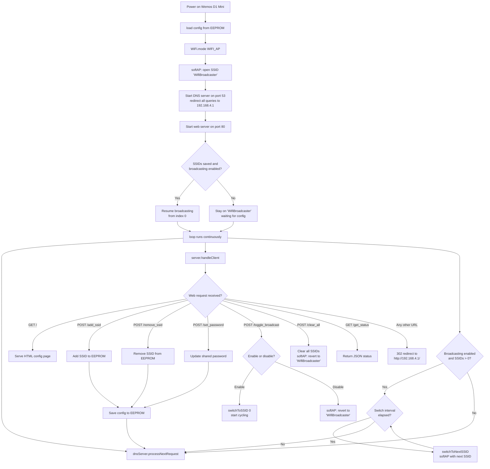

# Wemos D1 Mini Lite - WiFi Multi-SSID Broadcaster

A WiFi broadcaster that boots as a self-contained open access point with a captive portal for configuration. No router required — connect directly to the device to manage the SSIDs it broadcasts.

## Features

- **Zero-config access**: boots as an open AP with a captive portal, no router credentials needed
- **Captive portal**: any device that connects is automatically redirected to the config page
- **Multiple SSID Broadcasting**: add up to 10 SSIDs to rotate through
- **Rapid Switching**: automatically switches between SSIDs every 5 seconds
- **Web Configuration**: browser-based interface served directly from the device
- **Persistent Storage**: configuration saved to EEPROM, survives power cycles
- **Optional Password**: apply a shared password to all broadcast SSIDs, or leave open

## How It Works



## Hardware Requirements

- Wemos D1 Mini Lite (ESP8266)
- USB cable for programming and power

## Software Requirements

- Arduino IDE (1.8.x or newer)
- ESP8266 Board Package (includes `DNSServer`, `ESP8266WebServer`, `EEPROM`)

### Installing ESP8266 Board Package

1. Open Arduino IDE
2. Go to **File → Preferences**
3. Add this URL to "Additional Board Manager URLs":
   ```
   http://arduino.esp8266.com/stable/package_esp8266com_index.json
   ```
4. Go to **Tools → Board → Boards Manager**
5. Search for "esp8266" and install the package by ESP8266 Community

## Installation

1. **Clone or download** this project to your computer

2. **Open the sketch**:
   - Open `wifi_broadcaster.ino` in Arduino IDE

3. **Select the board**:
   - Go to **Tools → Board → ESP8266 Boards → LOLIN(WEMOS) D1 mini Lite**

4. **Select the port**:
   - Go to **Tools → Port** and select the port your Wemos is connected to

5. **Upload**:
   - Click the upload button (→)

No credentials need to be edited in the code — everything is configured at runtime via the web UI.

## Usage

### First Time Setup

1. **Power on** the Wemos D1 Mini Lite
2. On your phone or laptop, scan for WiFi networks
3. Connect to the open network **`WifiBroadcaster`**
4. A captive portal prompt will appear automatically — tap it, or navigate to `http://192.168.4.1`

### Configuring SSIDs

1. **Add SSIDs**:
   - Enter an SSID name in the "Add New SSID" field and click **Add SSID**
   - Repeat for each SSID you want to broadcast (max 10)

2. **Set Password** (optional):
   - Enter a password in the "Access Point Password" field and click **Set Password**
   - Leave empty to keep all broadcast SSIDs open
   - This password applies to all SSIDs in the list

3. **Start Broadcasting**:
   - Click **Toggle Broadcasting** to start cycling through your SSIDs
   - The device rotates every 5 seconds; the active SSID is highlighted in yellow

4. **Manage the list**:
   - Click **Remove** next to any SSID to delete it
   - Click **Clear All SSIDs** to wipe the list and return to the `WifiBroadcaster` setup AP

### Accessing the Config Page After Broadcasting Starts

Connect to whichever SSID the device is currently broadcasting. The captive portal DNS redirect is always active, so any HTTP request on that network will reach the config page at `192.168.4.1`.

## Configuration Options

### Changing the Default Setup SSID

Edit line 18 in the code:

```cpp
const char* SETUP_SSID = "WifiBroadcaster";
```

### Changing the Switch Interval

```cpp
#define SWITCH_INTERVAL 5000  // milliseconds — 5000 = 5 seconds
```

### Changing the Maximum SSID Count

```cpp
#define MAX_SSIDS 10
```

Increasing this uses more EEPROM space (each SSID slot is 32 bytes).

## Technical Details

### Network Architecture

The device operates in pure **`WIFI_AP`** mode at all times — it never connects to an external router.

| Component | Role |
|-----------|------|
| `WiFi.softAP()` | Creates the AP and controls the broadcasted SSID |
| `DNSServer` | Resolves all DNS queries to `192.168.4.1` (captive portal trigger) |
| `ESP8266WebServer` | Serves the config UI and API; unknown paths 302-redirect to `/` |
| `EEPROM` | Persists the SSID list, password, and enabled state |

### Captive Portal Flow

Most mobile OSes (Android, iOS, Windows) perform an HTTP probe on new networks. Because the DNS server resolves everything to `192.168.4.1`, the probe gets an unexpected response, which triggers the OS to pop up the captive portal dialog automatically.

### Memory Layout (EEPROM)

- **Total**: 512 bytes
- SSIDs: 10 × 32 bytes = 320 bytes
- Password: 64 bytes
- Metadata (`ssid_count`, `enabled`): ~8 bytes

## Troubleshooting

| Symptom | Fix |
|---------|-----|
| Captive portal dialog doesn't appear | Manually navigate to `http://192.168.4.1` |
| SSIDs not rotating | Ensure at least one SSID is added and **Toggle Broadcasting** is on |
| Config not saving | Check Serial Monitor (115200 baud) for "Configuration saved" |
| Can't reach config page mid-broadcast | Connect to the currently-active SSID, then visit `http://192.168.4.1` |

## Security Considerations

- This device broadcasts WiFi networks — use responsibly and only in environments you control
- Do not broadcast SSIDs that impersonate legitimate networks without explicit authorization
- Intended for authorized testing, research, and educational demonstrations only

## License

Provided as-is for educational purposes.
